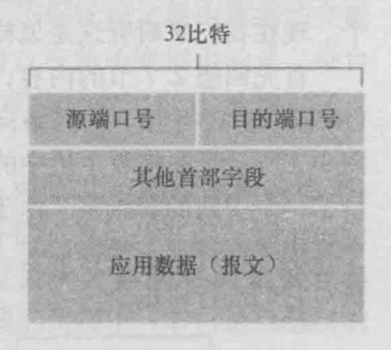
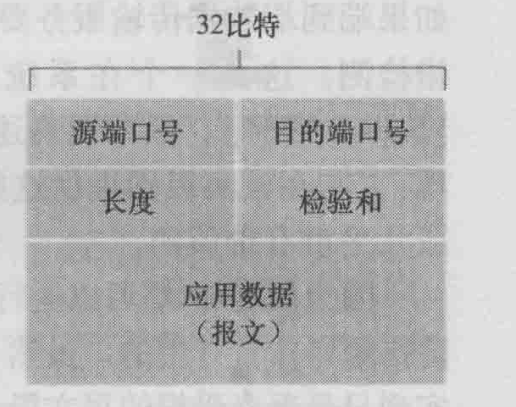
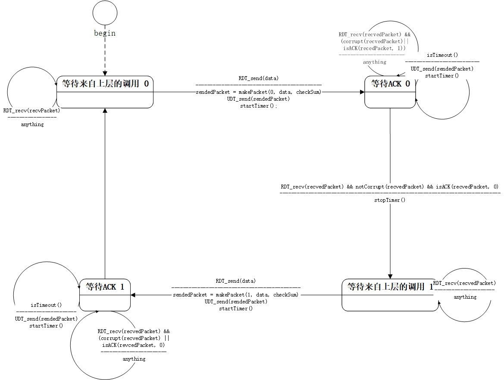
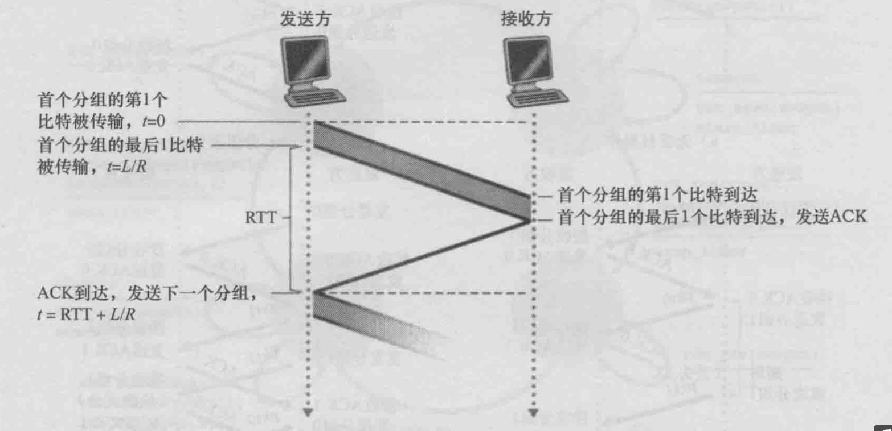
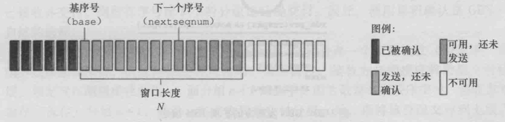
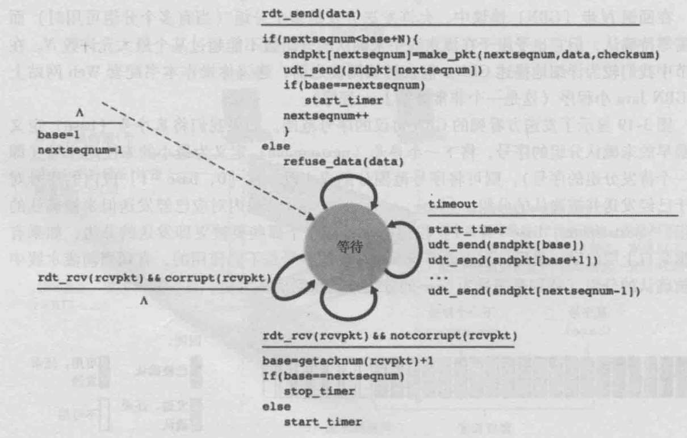
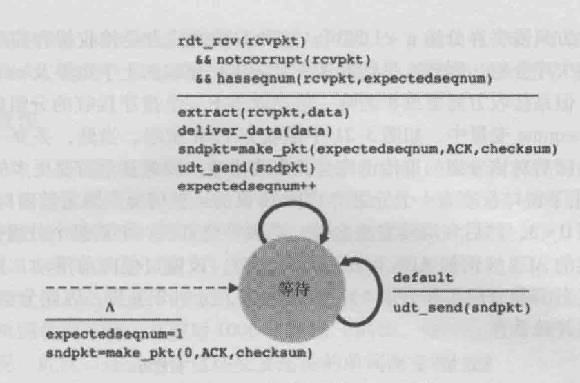
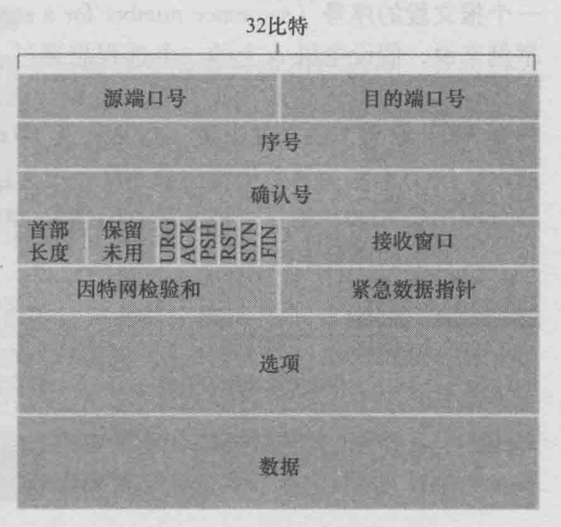
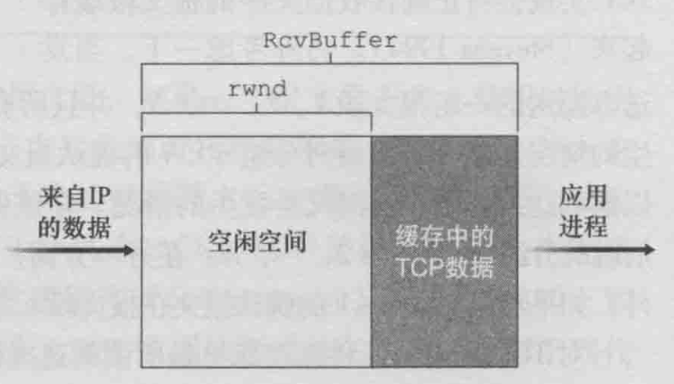

# 第三章 运输层

## 概述和运输层服务

+ 运输层协议为运行在不同主机上的应用进程之间提供了 **逻辑通信** 功能
+ 运输层协议是在端系统而不是在路由器中实现的

### 运输层和网络层的关系

+ 在协议栈中，运输层在网络层之上，网络层提供了主机之间的逻辑通信
+ 网络层相当于邮局，运输层相当于每家人中收集和分发邮件的那个家庭成员
+ 中间路由器既不处理也不识别运输层加在应用层报文的任何信息
+ 运输层协议能够提供的服务常常受制于底层网络层协议的服务模型，即如果网络层协议无法为主机之间发送的运输层报文提供时延或贷款保证的话，运输层协议也就无法为进程之间发送的应用程序报文提供时延或带宽保证

### 因特网运输层概述

+ 本书会将TCP和UDP的分组统称为 **报文段**
+ IP为主机之间提供逻辑通信
+ IP的服务模型是 **尽最大努力交付（best-effort delivery service)**，意味着：
    1. 它并不做任何确保
    2. 不确保报文段的交付
    3. 不保证报文段的顺序交付
    4. 不保证报文段中数据的完整性
+ IP被称为 **不可靠服务（unreliable service）**
+ UDP和TCP最基本的责任是：将两个端系统间IP的交付任务扩展到运行在端系统上的两个进程之间的交付任务，此过程被称为 **运输层的多路复用（transport-layer multiplexing）** 与 **多路分解（demultiplexing）**
+ UDP提供的仅有的两种服务：
    1. 进程到进程的数据交付
    2. 进程到进程的差错检查
+ UDP与IP一样，也是一种不可靠服务
+ TCP提供的服务：
    1. 进程到进·程的数据交付
    2. 进程到进程的差错检查
    3. 可靠数据传输（reliable data transport)
    4. 拥塞控制

## 多路复用和多路分解

+ 多路复用和多路分解是所有计算机网络都需要的，不仅仅是在因特网中
+ 运输层报文段中源与目的端口字段 

### 多路分解

+ 将运输层报文段中的数据交付到正确的套接字的工作称为 **多路分解**
+ 多路分解可以理解为：每家那个收集分发邮件的家庭成员将从邮递员那里取来的邮件，按照邮件的表明的收件人信息，交付给其余的家庭成员
+ 端口号是一个16bit的数，其大小在0 ~ 65535之间，周知端口号(well-known port number)：0 ~ 1023（是受限制的）

### 多路复用

+ 在源主机从不同套接字中收集数据块，并为每个数据块封装上首部信息从而生成报文段，然后将报文段传递到网络层，所有这些工作称为 **多路复用**
+ 多路复用可以理解为：收集分发邮件的家庭成员将收集来的邮件，交付给邮局
+ 要求：
    1. 套接字有唯一标识符
    2. 每个报文段有特殊字段来指示该报文段所要交付到的套接字

### 无连接的多路复用和多路分解

+ 如果应用程序开发者所编写的是一个“周知协议”的服务端，那么必须分配一个相应的周知端口号
+ 通常，应用程序的客户端让运输层自动地并且透明地分配端口号，而服务器端则分配一个特定地端口号
+ 如果有两个UDP报文段有不同的源IP地址和/或源端口号，但是具有相同的目的IP地址和端口号，那么两个报文段将通过 **相同的目的套接字** 被定向到 **相同的目的进程**
+ UDP使用一个 **二元组** 来标识套接字：（目的IP地址，目的端口号）
+ 源端口号用作“返回地址”的一部分

### 面向连接的多路复用与多路分解

+ TCP使用一个 **四元组** 来标识套接字：（源IP地址，源端口号，目的IP地址，目的端口号）
+ 与UDP不同，两个具有不同源IP地址或源端口号的到达TCP报文段将被定向到 **两个不同的套接字**

## 无连接运输：UDP

+ 使用UDP时，在发送报文段之前，发送方和接收方的运输层实体之间没有握手，正是因为如此，UDP被称为是无连接的
+ DNS通常使用UDP
+ 适合使用UDP的应用，有以下几点原因：
    1. 关于何时、发送什么数据的应用层控制更为精细。实时应用通常要求最小的发送速率，不希望过分地延迟报文段地传送，而且能容忍一些数据丢失
    2. 无需建立连接。UDP不会引入建立连接的时延（三次握手的时延）这可能是DNS运行在UDP之上，而不是在TCP之上的主要原因（如果运行在TCP上，则DNS会慢很多）
    3. 无连接状态。某些专门用于某种特定应用的服务器当应用程运行在UDP上是，一般能支持更多的活跃用户
    4. 分组首部开销小。UDP报文段仅有８字节
+ UDP被用于RIP路由选择表的更新，因为这些更新被周期性地发送（通常每5分钟一次），更新的丢失能被最近的更新所替代，因此丢包、过期的更新是无用的
+ UDP也用于承载网络管理数据（SNMP）

### UDP报文段结构

+ UDP报文段结构 

### UDP校验和

+ **校验和** 用来确定当UDP报文段从源到达目的地移动时，其中的比特是否发生了变化
    >UDP在源处先算出校验和（三个字段相加求反），到达目的地后将三个字段与检验和相加
+ **端到端原则**：因为某种功能必须基于端到端实现：*与在较高级别提供这些功能的代价相比，在较低级别上设置的功能可能是冗余的或是几乎没有价值的

## 可靠数据传输原理

+ 实现这种服务抽象的是 **可靠数据传输协议**（reliable data transfer protocol RDT）
+ 与之对应的是 **非可靠数据传输协议**（unreliable data transfer protocol UDT）

### 构造可靠数据传输协议

+ 肯定确认（positive acknowledgement）：**ACK**
+ 否定确认（negative acknowledgment）：**NAK**
+ 在计算机网络环境中，基于重传机制的可靠数据传输协议称为 **自动重传请求（Automatic Repeat reQuest，ARQ）**
+ ARQ协议中需要另外三种协议功能来处理存在比特差错的情况：
    1. 差错检查
    2. 接收方反馈（ACK，NAK）
    3. 重传
+ 当发送方处于等待ACK或是NAK的状态时，它不能从上层获得更多的数据（这样的协议称为 **停等协议** stop-and-wait）
+ 发送方 
+ 停等协议时序图
+ 流水线技术对可靠数据传输协议带来的影响：
    1. 增加序号范围
    2. 协议的发送方和接收方需要缓存多个分组
    3. 所需序号范围和对缓冲的要求取决于数据传输协议如何处理丢失、损坏及延时过大的分组
+ 解决流水线的差错恢复有两种基本方法：**退回N步（Go-Back-N，GBN）**和 **选择重传（Selective Repeat，SR）**

### 退回N步

+ 在GBN协议中，允许发送方发送多个分组（当有多个分组可用时）而不需要等待确认，但也受限于在流水线中未确认的分组数不能超过某个最大允许数N
+ N被称为 **窗口长度**
+ 组成：
    1. 基序号（base）：定义了为最早的未确认分组的序号
    2. 下一个序号（nextseqnum）：定义为最小的未使用序号（下一个待发分组的序号）
    3. 序号范围分成4段：
        1. `[0, base - 1]`：对应于已经发送并被确认的分组
        2. `[base, nextseqnum - 1]`：对应于已经发送但违背确认的分组
        3. `[nextseqnum, base + N - 1]`：用于那些要被立即发送的分组
        4. `[base + N, +∞)`：不能使用
+ 在GBN中发送方看到的序号：
+ GBN协议也被称为 **滑动窗口协议（sliding-window protocol SWP）**
+ 在实际中，一个分组的序号承载在分组首部的一个固定长度的字段中，如果分组序号字段的比特数为`k`，则序号范围是 **[0,  $2^k$ - 1]**，在一个有限的序号范围内，所有涉及序号的运算必须是使用模 $2^k$运算
+ GBN发送发的扩展FSM 
+ GBN接收方的扩展FSM 
+ 在GBN协议中，接收方丢弃所有失序分组，哪怕是一个正确的，但是失序的分组

### 选择重传

+ 通过让发送方仅重传那些它怀疑在接收方出错（即丢失或是受损）的分组
+ 对于SR协议而言，发送方和接收方的窗口并不总是一样的
+ 窗口长度必须小于或等于序号空间大小的一半
+ 序号可以被重新使用，需要避免出现冗余分组
+ 实际应用中采用的方法是，确保一个序号不被重新使用，直到发送方“确信”任何先前发送的序号为x的分组都不在网络中为止

## 面向连接的运输：TCP

### TCP连接

+ TCP把数据看成一个无结构的、有序的字节流
+ TCP协议只在端系统中运行，所以中间的网络元素不会维持TCP连接状态，并且实际上，中间路由器对TCP连接完全视而不见
+ TCP连接提供的是 **全双工（full-duplex service）**
+ TCP建立连接的过程被称为 **三次握手（three-way handshake）**
+ TCP将数据引导到该连接的 **发送缓存（send buffer）** 里，发送缓存是在三次握手初期设置的缓存之一，
+ TCP可以从缓存中取出并放入报文段中的数据数量受限于 **最大报文段长度（Maximun Segment Size，MSS）**
+ MSS通常根据最初确定的由本地主机发送的最大链路层帧长度（即 **最大传输单元（Maximun Transmission Unit，MTU）**）来设置
+ TCP为每块客户数据配上一个TCP首部，从而向形成多个 **TCP报文段（TCP Segment）**
+ TCP连接的每一端都有各自的 **发送缓存** 和 **接收缓存**
+ TCP连接的组成包括：
    1. 一台主机上的缓存、变量和进程连接的套接字
    2. 另一台主机上的缓存、变量和进程连接的套接字

### TCP报文段结构

+ TCP报文段结构图
    1. 32bit **序号字段（sequence number field）** 和32bit **确认号字段（acknowledgment number field）**：用于实现可靠数据传输
    2. 16bit **接收窗口字段（receive window field）**：用于流量控制，指示接收方愿意接受的字节数量
    3. 4bit **首部长度字段（header length field）**：指示了以32bit的字为单位的TCP首部长度
    4. 可选与变长的 **选项字段（options field）**：用于发送方与接收方协商MSS时，或在高速网络环境下作为 **窗口调节因子** 使用
    5. 6bit **标志字段（flag field）**：**ACK字段**

#### 1. 序号和确认号

+ TCP报文段首部中最重要的两个字段
+ 主机A填充进报文段的确认号是主机A期望从主机B收到的下一个字节的序号
+ 一个报文段的序号就是该报文段数据字段首字节的序号

### 往返时间的估计与超时

#### 1. 估计往返时间

+ 大多数TCP的实现仅在某一时刻做一次 **SampleRTT测量**（报文段的样本RTT）
+ TCP不已被重传的报文段计算SampleRTT

>TCP维持一个SampleRTT平均值 **EstimatedRTT**，一旦获得一个新的SampleRTT，就根据下列公式更新EstimatedRTT：（α的参考值一般是 1/8）
>
>    $$ EstimatedTRR = (1 - α) * EstimatedRTT + α * SampleRTT $$
>
>从统计学的观点讲，这种平均被称为 **指数加权移动平均（Exponential Weighted Moving Average，EWMA）**
---------------------------------
>**DevRTT**，用于估算SampleRTT一般会偏离EstimatedRTT的程度
>
>$$ DevRTT = (1 - β) *  DevRTT + β * | SampleRTT - EstimatedRTT | $$

#### 2. 设置和管理超时重传的时间间隔

+ 综合考虑估计值和估计值与测量值的偏差程度，超时重传的时间间隔使用下列公式得出：
    $$ TimeoutInterval = EstimatedRTT + 4 * DevRTT $$
    推荐的初始TimeoutInterval为1秒

### TCP的可靠数据传输

+ TCP的可靠数据传输服务确保一个进程从其接收缓存中读出的数据流是无损坏、无间隔、非冗余和按序的数据流，即该字节流与连接的另一方端系统发送的字节流完全相同
+ 与发送和重传有关的主要事件：
    1. 从上层应用内程序接收数据；定时器超时和收到ACK
    2. 超时。TCP通过重传引起超时的报文段来相应超时事件。然后TCP重启定时器
    3. 来自接收方的确认报文段（ACK）的到达（确切地说是一个包含了有效ACK字段值的报文段）

#### 快速重传

+ **冗余ACK（duplicate ACK）**：再次确认某个报文段的ACK，而发送方先前已经收到了对该报文段的确认
+ 一旦收到3个DACK，TC就执行 **快速重传（fast retransmit）**

#### GBN与SR的选择

+ TCP使用 **选择确认（selective acknowledgment）**

### 流量控制

+ TCP使用 **流量控制服务（flow-control service）** 以消除接收方缓存溢出的可能性
+ TCP通过让发送方维护一个 **接收窗口（receive window，rwnd）**
+ rwnd的大小通过下列公式得出：
    > def: LastByteRead = 从缓存中读出的数据流的最后一个字节的编号
    > def: LastByteRcvd = 从网络中到达并且已经放入缓存中的数据流的最后一个字节的编号
    > def: RcvBuffer = 接收缓存大小
    > 由于TCP不允许已分配的缓存溢出，下式必须成立：
    >$$ LastByteRcvd - LastByteRead <= RcvBuffer $$
    >则rwnd可以表示为：
    >$$ rwnd = RcvBuffer - [LastByteRcvd - LastByteRead] $$
+ 接收窗口和接收缓存
+ 开始时，rwnd = RcvBuffer

### TCP连接管理

+ 建立步骤：
    1. Client TCP首先向Server TCP发送一个特殊的TCP报文段
        1. 该报文段没有应用层数据，在首部中一个标志位（SYN bit）被置为1
        2. 此外客户会随机选择一个 **初始序号（client_isn）**，放置于该起始TCP SYN报文段的序号字段
    2. TCP SYN报文段的IP数据报到达服务器主机时
        1. 服务器提取出TCP SYN报文段
        2. 分配TCP连接的TCP缓存和变量
        3. 向该客户TCP发送允许连接报文段
            1. SYN bit被置为1
            2. 首部的确认号被置为client_isn + 1
            3. 服务器选择自己的初始序号（server_isn）
        4. 该报文段被称为 **SYNACK报文段**
+ 连接关闭：客户TCP向服务器进程发送一个特殊的TCP报文段，此报文段的FIN标志位被置为1

## 拥塞控制原理
