# 第四章 网络层

+ 构造网络层分组交付的方法：数据报模式和虚电路模式
+ 转发（forwarding）：涉及到分组在单一的路由器中从一条入链路到一条出链路的传送
+ 路由选择（routing）：涉及到一个网络的所有路由器，它们经路由选择协议共同交互，以决定分组从源到目的地节点所采用的路径

## 概述

### 转发和路由选择

+ 转发（forwarding）：当一个分组到达路由器的一条输出链路时，路由器必须将该分组移动到设当的输出链路
+ 路由选择（routing）：当分组从发送方流向接收方时，网络层必须决定这些分组所采用的路由或路径
+ 计算这些路径的算法称为 **路由选择算法（routing algorithm）**
+ 每台路由器具有一张 **转发表（forwarding table）**：路由器通过检测到达的分组首部字段的值来转发分组，并使用该值在该路由器的转发表中索引查询。在转发表中，首部值与输出链路标号形成映射

### 网络服务模型

+ **网络服务模型（network service model）** 定义了分组在发送与接收端体统之间的端到端运输特性
+ 特定服务包括：
    1. 确保交付
    2. 具有时延上街的确保交付
    3. 有序分组交付
    4. 确保最小带宽
    5. 确保最大时延抖动
    6. 安全性服务
+ 因特网的网络层提供单一的服务，称为 **尽最大努力交付（best-effort service）**

## 虚电路和数据报网络

+ 网络层中的连接和无连接服务于运输层中的类似，但也存在着重大差异：
    1. 在网络层中，这些服务是由网络成向运输层提供的主机到主机的服务（运输层中是进程到进程）
    2. 至今为止，所有的网络层体系结构中，网络层仅在连接和无连接两者之中选择一种（即要不是无连接，要不是有连接），而不会同时运行两种服务
    3. 仅在网络层提供 ***连接服务*** 的计算机网络称为 **虚电路（Virtual—Circuit，VC）网络**
    4. 仅在网络层提供 ***无连接服务*** 的计算机网络称为 **数据报网络（datagram network）**

### VC网络

+ VC的组成：
    1. 源到目的主机之间的路径（即一系列链路和路由器）
    2. VC号：沿着该路径的每段链路的一个号码
    3. 沿着该路径的每台路由器中转发表表项
+ 跨越一台路由器创建一个条新的VC，转发表增加一个新的表项；终止一条虚电路，沿着该路径每个表中的相应项将被删除
+ VC的三个阶段：
    1. VC建立：
        1. 发送运输层与网络层的联系
        2. 指定接收方地址
        3. 等待建立VC
        4. 网络层决定发送方与接收方之间的路径，也将沿着这条路径，为每个链路决定一个VC号，并为在该路径上每一个链路增加一个表项
        5. 在建立期间，还可以在预留该虚电路路径上的资源（如带宽）
    2. 数据传输
    3. 虚电路拆除
+ 端系统项网络发送VC启动与终止的报文，以及路由器之间传递的由于建立虚电路的报文，称之为 **信令报文（signaling message）**
+ 用来交换这些报文的协议称之为 **信令协议（signaling protocol）**

### 数据报网络

+ 在DN中，转发表通过路由选择算法进行修改，通常每1 ~ 5分钟左右更新一次
+ 当有一个目的地址可能与多个表项相匹配时，路由器使用 **最长前缀匹配规则（longest prefix matching rule）

## 路由器工作原理

+ 路由器体系结构 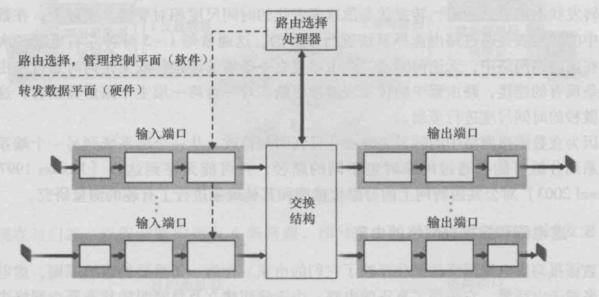
+ 路由器的4个组成部分
    1. 输入端口：
        1. 执行一条输入的物理链路与路由器相连接的物理层功能
        2. 执行需要与位于入链路远端的数据链路层交互的数据链路层的功能
    2. 交换结构：是一个路由器中的网络
    3. 输出端口
    4. 路由选择处理器：
        1. 执行路由选择协议
        2. 维护路由选择表以及连接的链路状态信息
        3. 为路由器计算转发表
        4. 执行网络管理功能

+ 这里的端口，是指物理的输入端口和输出端口
+ 转发功能有时总称为 **路由器转发平面（router forwarding plane，RFP）**，并总是由硬件实现
+ 路由器的控制功能，总称为 **路由器控制平面（router control plane，RCP）**，通常用软件实现，并在路由选择处理器上执行

### 输入端口

+ 输入端口处理 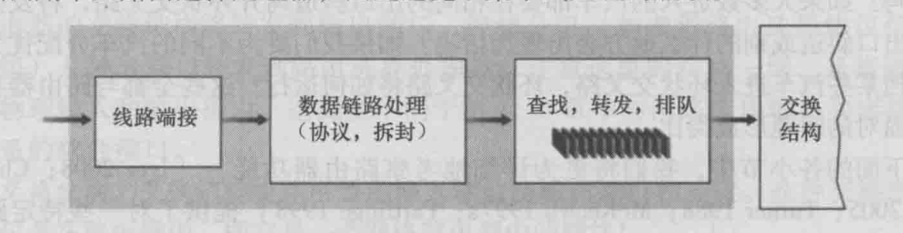
+ 转发表的一份影子副本通常被存放在每个输入端口，转发表从路由选择处理器经独立总线复制到线路卡
+ 影子副本的使用，可以使得转发决策能在每个输入端口本地做出，不需要调用中央路由选择处理器，避免了集中式处理地瓶颈
+ 输入端口的动作：
    1. 检索转发表
    2. 物理层和链路层的处理
    3. 检查分组的版本号、校验和以及寿命字段，并重写校验和与寿命字段
    4. 更新网络管理的计数器（如接收到的IP数据报数目）

### 交换结构

+ 常见的三种交换技术：
    1. 经内存交换 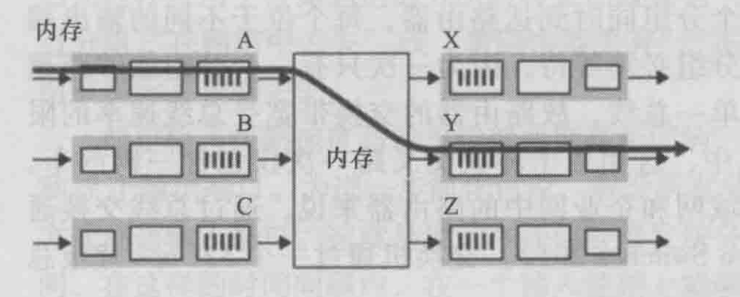
    2. 经总线交换 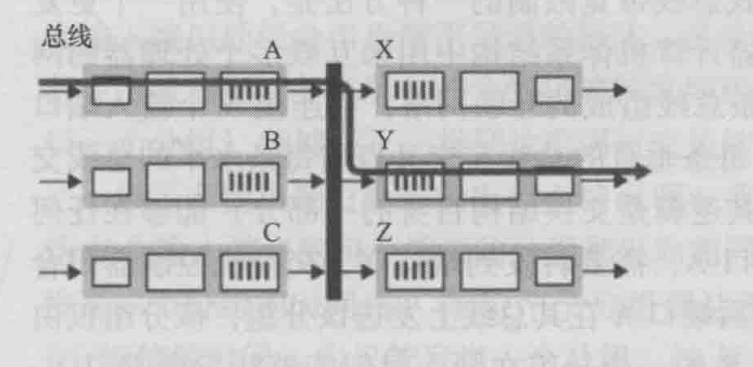
    3. 经互联网交换 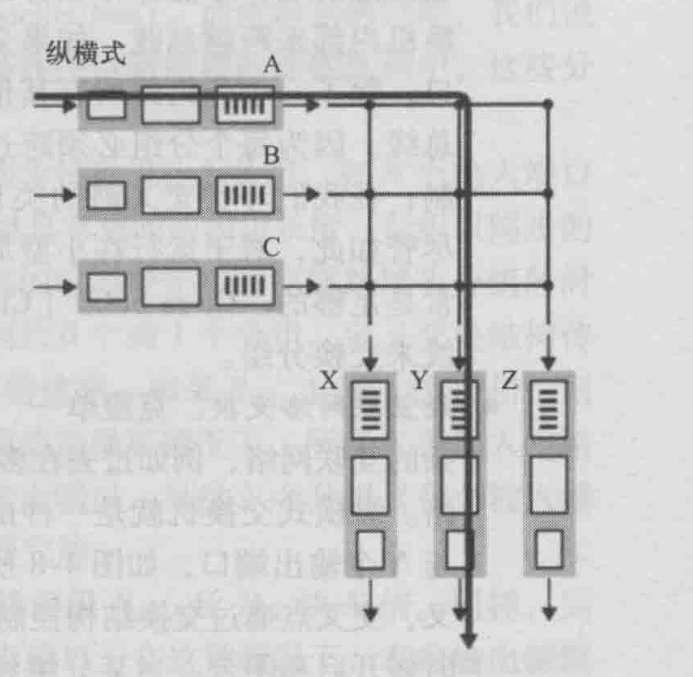

### 输出端口

+ 输出端口处理 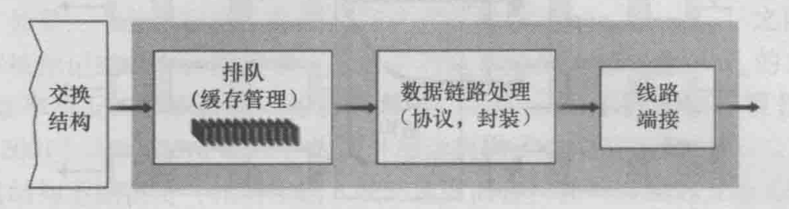

### 何时出现排队

+ 经验方法，基于相对少量的TCP流量的排队动态分析：缓存数量（B）应当等于RTT乘以链路的容量（C）
    $$ B = RTT * C $$
+ 最近的理论和实验研究表明，当有大量的TCP流（N）流经一条链路时，公式变为：
    $$ B = RTT * C/\sqrt{R} $$
+ 输出端口排队的结果是，在输出端口上的一个 **分组调度程序（packet scheduler）** 必须在这些排队的分组中选出一个来发送。（算法有，如FCFS（先来先服务），WFQ（加权公平排队））
+ **主动队列管理（Active Queue Management，AQM）** 算法：在某些情况下，在缓存填满前便丢弃（或是在首部加标记）一个分组
+ **随即早期检测（Random Early Detection，RED）** 算法是一种推广的AQM

### 路由选择控制平面

+ 网络范围的RFP是分布式的

## 网际协议：因特网中的转发和编址

+ IP协议版本4：**IPv4**
+ IP协议版本6：**IPv6**
+ 因特网网络层的内部视图 

### 数据报格式

+ IPv4数据报格式 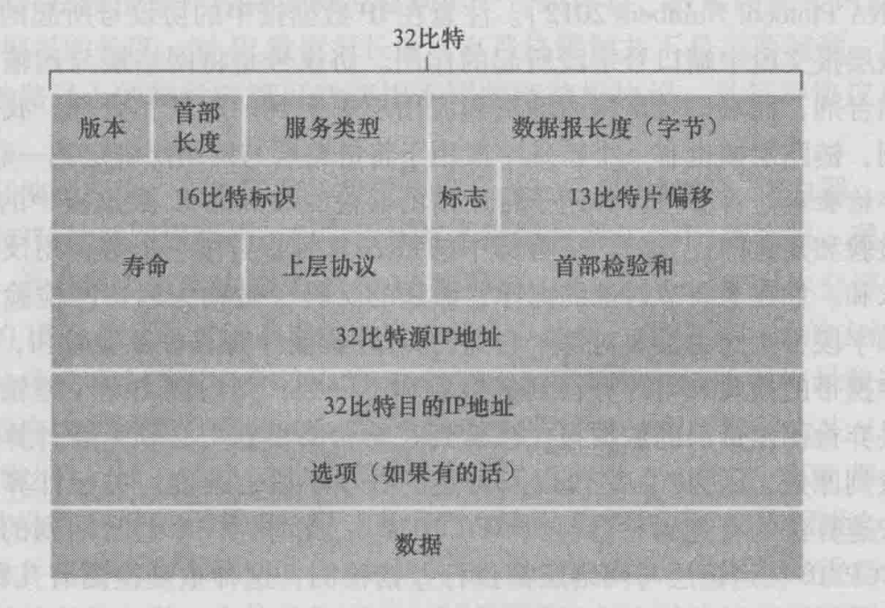
+ 关键字段：
    1. 版本号：根据版本号确定数据报格式
    2. 首部长度：因为IPv4包含一些可变数量的选项，所以需要4 bit来确定数据报中数据部分实际从哪里开始
    3. 数据报长度：IP数据报的总长度（首部 + 数据）
    4. 标识、标志、片偏移
    5. 寿命：**（Time-To-Live，TTL）** 确保数据报不会永远在网络中循环，若TTL字段减为0，则该数据报需要被丢弃
    6. 协议：指示IP数据报的数据部分应交给哪个特定的运输层协议
    7. 首部校验和：数据报的校验和
    8. 源和目的IP地址
    9. 选项
    10. 数据（有效载荷）

#### IP数据报分片

+ 一个链路层帧能承载的最大数据量称为 **最大传送单元（Maximum Transmission Unit，MTU）**
+ 过长的数据报会被分成一个个，大小小于当前协议下MTU的 **片（fragment）** 继续传送
+ 片的组装，在目的主机中进行
+ 如果一个或多个片段没有到达目的地，则不完整的数据报被丢弃，且不会交给运输层。若运输层正在使用TCP，则TCP会让源以初始数据报来重传数据

### IPv4编址

+ 一台主机通常只有一条链路连接到网络
+ 主机与物理链路之间的边界叫做 **接口（interface）**，路由器与它的任意一条链路之间的边界也叫接口
+ IPv4地址一般按照 **点分十进制（dotted-decimal notation）** 书写
+ 接口地址和子网 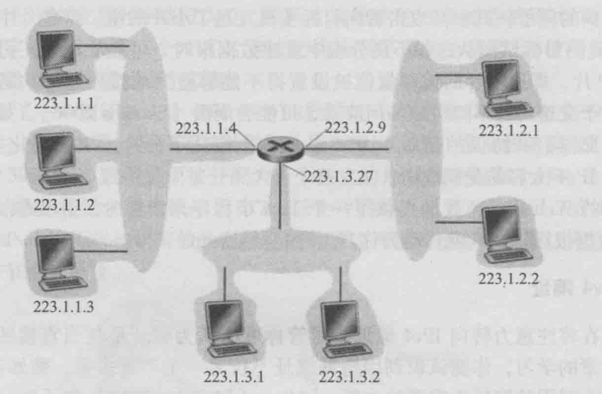
+ 用IP的术语来说，互联的这3个主机接口和1个路由器接口的网络形成一个 **子网（sub-net）**
    1. IP编址为这个子网分配一个地址：`223.1.1.0/24`，其中的`/24`记发，称为 **子网掩码（network mask）**，指示了32 bit中的最左侧24 bit定义了子网地址
    2. 子网`223.1.1.0/24`是由3主机（`223.1.1.1`、`223.1.1.2`、`223.1.1.3`）和一个路由器接口（`233.1.1.4`）组成的
+ 确定子网：分开主机和路由器的每个接口，产生几个隔离的网络岛，使得接口端接这些隔离的网络的端点。这些隔离的网络中的每一个都叫一个子网
+ 因特网的地址分配策略被称为 **无类别域间路由选择（Classless Interdomain Routing，CIDR）**
    1. 对于子网寻址：32 bit的IP地址被划分为两个部分——`a.b.c.d/x`，其中x指示了地址中的第一部分比特数
    2. x的最高比特构成了IP地址的网络部分，并被称为该地址的 **前缀（prefix）**
    3. 一个组织通常被分配一块连续的地址，即具有相同前缀的一段地址，在这种情况下，组织内部的设备的IP地址共享共同的前缀
    4. 剩余的 32 - x 比特可以认为使用用于区分该组织内部设备的
+ 网址分配过程：
    1. 获取一块地址
    2. 获取主机地址：**动态主机配置协议（Dynamic Host Configuration Protocol，DHCP）**
        1. 允许主机自动获取（被分配）一个IP地址
        2. 网管可以设置一台主机每次使用时，都是同一个IP地址
        3. 允许一台主机得知其他的自身信息：子网掩码、第一跳路由器地址（默认网关）、本地DNS服务器的地址
        4. DHCP客户-服务器交互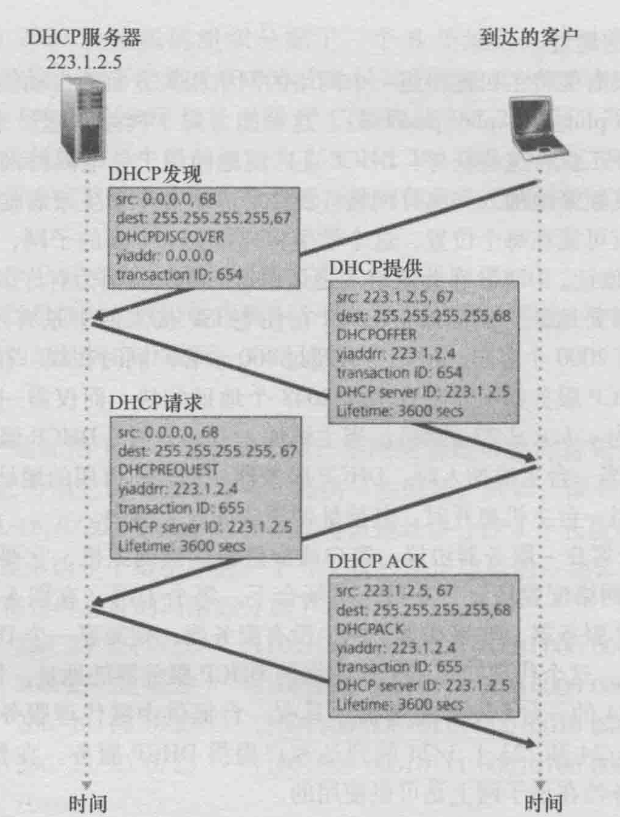
            1. DHCP服务器发现：主机通过使用广播目的地址`255.255.255.255`和本主机源地址`0.0.0.0`，向全局进行广播
            2. DHCP服务器提供：提供的报文有：
                1. 收到的发现的报文的事务ID
                2. 向客户推荐的IP地址
                3. 网络掩码
                4. IP地址租用期（IP地址有效时间量）
            3. DHCP请求：回显配置参数
            4. DHCP ACK：对DHCP请求进行响应，证实配置参数
        5. DHCP又常被称为 **即插即用协议（plug-and-plug protocol，PPP）**
    3. 网络地址转换（Network Address Translation，NAT）
    4. **UPnP（通用即插即用）**：UPnP允许外部主机使用TCP或是UDP向NAT化的主机发起通信会话

### 因特网控制报文协议

+ 因特网控制报文协议 **（Internet Control Message Protocol，ICMP）** 最典型的用途是差错报告
+ ICMP报文是作为IP有效载荷承载的
+ ICMP报文有一个类型字段和一个编码字段 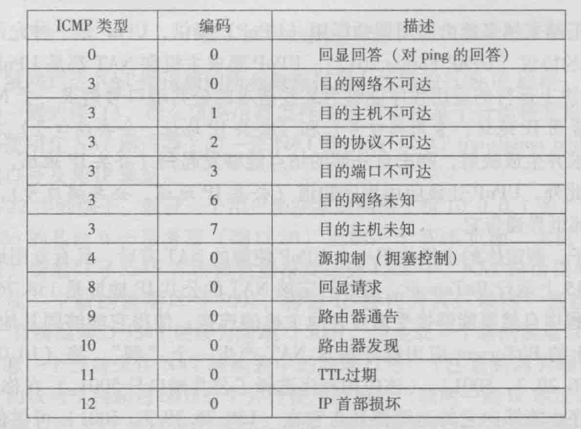

### IPv6

+ 数据报格式 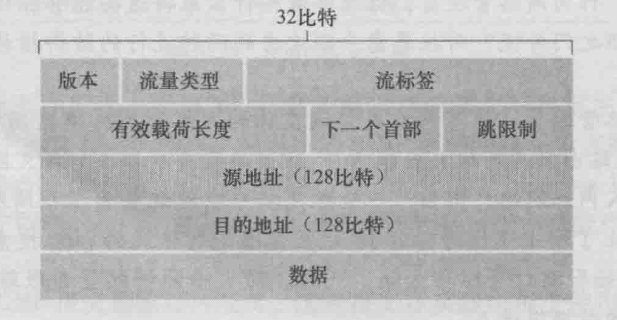
    1. 跳限制：数据报每经过一个路由器，该字段减1，当到达0时，该数据报将被丢弃
+ 不再存在的字段：
    1. 分片/重新组装
    2. 首部校验和
    3. 选项：可能会出现在IPv6首部中指出的“下一个首部”，也可能就是“下一个首部”

## 路由选择算法

+ 主机通常直接与一台路由器相连接，该路由器即为该主机的 **默认路由器 （default router）**，又称 **第一跳路由（first-hop router）**
+ 算法分类一：
    1. 全局式路由选择算法（global routing algorithm）
    2. 分散式路由选择算法（decentralized routing algorithm）
+ 算法分类二：
    1. 静态路由选择算法（static routing algorithm）：随时间的变化，路有变化非常缓慢，通常是人工干预调整
    2. 动态路由选择算法（dynamic routing algorithm）
+ 算法分类三：
    1. 负载敏感算法（load-sensitive algorithm）
    2. 负载迟钝算法（load-insensitive algorithm）

## PS其后内容与算法有关
