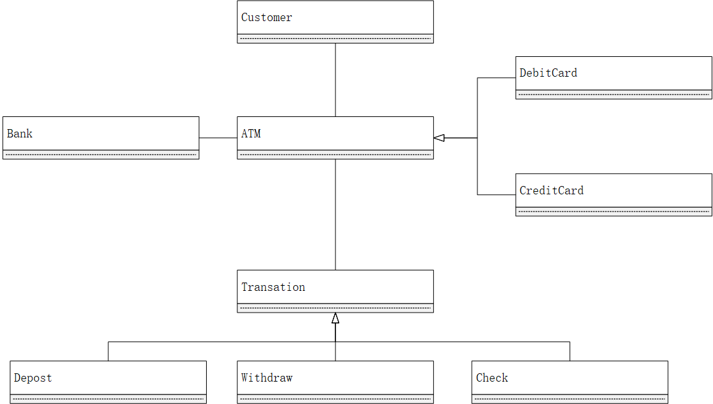

# Chapter 2 Diagram

+ Class diagram
    1. is a structural diagram
    2. it represent static view
    3. it describe attributes and methods
    4. it shows collection of classes and relationship
    5. There are 2 types of relationship used
        1. Association: Aggregation, Composition
        2. Generalization
+ Multiplicities: Indicate the number of instance of one class linked with one instance of other class
    1. 1 - no more then one (only one)
    2. 0 - zero
    3. \* - many
    4. 1 ... * - one or many
    5. 0 ... 1 - zero or one
+ Visibility:
    1. "+" - is used to denote **Public** Visibility    (every one)
    2. "-" - is used to denote **Private** Visibility   (no one)
    3. "#" - is used to denote **Protected** Visibility (drivel one)
+ Compare: Aggregation VS Composition
    >Aggregation|Composition
    >|:---------|:---------|
    >Part can be shared by several wholes|Part is always a part of a single whole
    >Parts can live independently|Parts exist only as part of the whole
    >Whole is not solely responsible|Whole is responsible and should create / destroy the objects
+ Draw class Diagram for ATM: 
